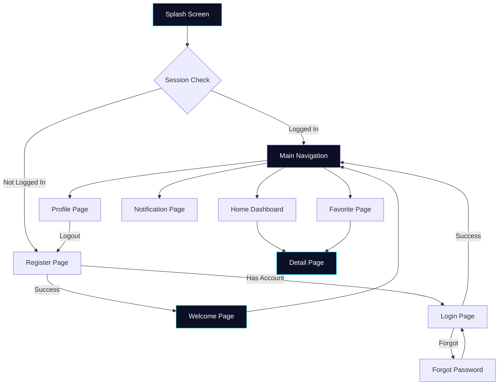

<!-- ANIMATED HEADER -->
<p align="center">
  
</p>

<p align="center">
  <a href="https://flutter.dev">
    
  </a>
  <a href="https://dart.dev">
    
  </a>
  <a href="https://firebase.google.com">
    
  </a>
  <a href="https://api.spaceflightnewsapi.net">
    
  </a>
</p>

<p align="center">
  <a href="https://github.com/henokhyeremia/spacenews-core">
    
  </a>
  <a href="https://github.com/henokhyeremia/spacenews-core/blob/main/LICENSE">
    
  </a>
  
  
</p>

<p align="center">
  
</p>

<p align="center">
  
  
  
</p>

<br/>

<!-- PROJECT OVERVIEW -->
## 🚀 Project Overview

**SpaceNews Core** is a premium Flutter-based international news portal delivering real-time spaceflight and astronomy news. Built with a futuristic dark space theme, the application integrates **Firebase Authentication**, **Cloud Firestore**, and the **SpaceFlight News API** to provide a seamless, enterprise-grade reading experience.

> *"Exploring the universe, one article at a time."*

<br/>

<!-- MAIN FEATURES -->
## ✨ Main Features

| # | Feature | Description | Status |
|---|---------|-------------|--------|
| 🚀 | **Splash Screen** | 3-second animated splash with logo, gradient background, and session check | ✅ |
| 📝 | **Register Page** | Glassmorphism form with name, email, password validation | ✅ |
| 🔐 | **Login Page** | Secure authentication with session persistence | ✅ |
| 🔑 | **Forgot Password** | Password reset via Firebase email link | ✅ |
| 👋 | **Welcome Page** | Hero image introduction with animated entry | ✅ |
| 🏠 | **Home Dashboard** | Personalized greeting + headline banner + news feed | ✅ |
| 📰 | **Dynamic News Feed** | Live articles from SpaceFlight News API with loading/error states | ✅ |
| 🎯 | **Headline Banner** | Premium hero card featuring top breaking news | ✅ |
| 📖 | **Detail Article Page** | Immersive reading view with favorite toggle | ✅ |
| ❤️ | **Favorite System** | Real-time Firestore favorites with StreamBuilder | ✅ |
| 🔔 | **Notification Page** | Enterprise notification timeline with categorized icons | ✅ |
| 👤 | **Profile Page** | Dynamic user info display from Firestore | ✅ |
| 🚪 | **Logout** | Secure sign-out with session clearing + stack cleanup | ✅ |

<br/>

<!-- APP FLOW -->
## 🔄 App Flow



<br/>

<!-- TECH STACK -->
## 🛠 Tech Stack

<p align="center">
  
  
  
  
</p>

<p align="center">
  
  
  
  
</p>

| Technology | Purpose | Version |
|------------|---------|---------|
| 🎯 **Flutter** | Cross-platform framework | `3.41+` |
| 📝 **Dart** | Programming language | `3.11+` |
| 🔥 **Firebase Core** | Firebase initialization | `3.15+` |
| 🔐 **Firebase Auth** | Authentication service | `5.7+` |
| 📦 **Cloud Firestore** | NoSQL document database | `5.6+` |
| 💾 **SharedPreferences** | Local key-value storage | `2.5+` |
| 🌐 **HTTP** | REST API client | `1.3+` |
| 🖼 **cached_network_image** | Image caching & loading | `3.4+` |
| ✒️ **Google Fonts** | Typography system | `6.3+` |
| 📅 **Intl** | Date formatting & i18n | `0.20+` |
| 🎬 **Flutter Animate** | Advanced animations | `4.5+` |

<br/>

<!-- API INTEGRATION -->
## 🌍 API Integration

This application consumes the **[SpaceFlight News API](https://api.spaceflightnewsapi.net/v4)** — an open-source REST API providing spaceflight-related articles from multiple global sources.

### Endpoint

```
GET https://api.spaceflightnewsapi.net/v4/articles/?limit=20
```

### Response Structure

```json
{
  "count": 12345,
  "next": "...",
  "previous": null,
  "results": [...]
}
```

Articles are parsed from the `results` key.

### Article Fields

| Field | Type | Description |
|-------|------|-------------|
| `id` | `int` | Unique article identifier |
| `title` | `String` | Article headline |
| `url` | `String` | Original article URL |
| `image_url` | `String` | Hero/news image URL |
| `news_site` | `String` | Publishing source name |
| `summary` | `String` | Brief article summary |
| `published_at` | `String` | ISO 8601 publish date |
| `updated_at` | `String` | ISO 8601 last updated date |

> **No API key required.** The SpaceFlight News API is freely available for public use.

<br/>

<!-- FIREBASE ARCHITECTURE -->
## 🔥 Firebase Architecture

### Collections

```
firestore/
├── users/{uid}
│   ├── uid: String
│   ├── name: String
│   ├── email: String
│   ├── instagram: String
│   ├── photoUrl: String
│   └── createdAt: String (ISO 8601)
│
└── favorites/{favoriteId}
    ├── favoriteId: String ("{uid}_{articleId}")
    ├── articleId: int
    ├── title: String
    ├── imageUrl: String
    ├── newsSite: String
    ├── summary: String
    ├── url: String
    ├── publishedAt: String
    ├── userId: String
    └── createdAt: String (ISO 8601)
```

### Key Design Decisions

- **Favorite deduplication** — `favoriteId` uses the pattern `{userId}_{articleId}` to prevent duplicate entries.
- **Realtime sync** — Favorites use Firestore `StreamBuilder` for live updates across sessions.
- **User data** — Stored once at registration in `users/{uid}` and fetched dynamically on the Profile page.

<br/>

<!-- LOCAL STORAGE -->
## 💾 Local Storage

**SharedPreferences** manages local session persistence.

| Key | Value | Description |
|-----|-------|-------------|
| `is_logged_in` | `bool` | Login session flag |

### Service Methods

| Method | Description |
|--------|-------------|
| `saveLoginSession()` | Persists login status after authentication |
| `isLoggedIn()` | Checks if user has an active session (returns `bool`) |
| `clearSession()` | Removes all stored session data on logout |

### Session Flow
1. User logs in → `saveLoginSession()` called
2. App starts → Splash checks `isLoggedIn()` + `FirebaseAuth.currentUser`
3. User logs out → `clearSession()` + `FirebaseAuth.signOut()`
4. Session cleared → Redirected to Register page

<br/>

<!-- FOLDER STRUCTURE -->
## 📁 Project Structure

```
lib/
├── main.dart                          # Entry point with Firebase init
├── app.dart                           # MaterialApp + dark theme config
├── firebase_options.dart              # Auto-generated by FlutterFire CLI
│
├── core/
│   ├── constants/
│   │   ├── app_colors.dart            # Color palette & gradients
│   │   └── app_strings.dart           # Centralized string constants
│   ├── theme/
│   │   └── app_theme.dart             # Dark futuristic theme definition
│   ├── utils/
│   │   ├── date_formatter.dart        # Date formatting & time-ago
│   │   └── validators.dart            # Input validation functions
│   └── widgets/
│       ├── app_logo.dart              # Animated circular logo
│       ├── custom_text_field.dart     # Reusable input field
│       ├── empty_state.dart           # Empty state placeholder
│       ├── error_view.dart            # Error display + retry
│       ├── gradient_background.dart   # Reusable gradient container
│       ├── loading_view.dart          # Loading spinner indicator
│       └── primary_button.dart        # Gradient action button
│
├── data/
│   ├── models/
│   │   ├── article_model.dart         # API article data model
│   │   ├── favorite_model.dart        # Firestore favorite model
│   │   ├── notification_model.dart    # Notification data model
│   │   └── user_model.dart            # Firestore user model
│   └── services/
│       ├── api_service.dart           # SpaceFlight News API client
│       ├── auth_service.dart          # Firebase Auth wrapper
│       ├── firestore_service.dart     # Firestore CRUD operations
│       └── local_storage_service.dart # SharedPreferences service
│
└── features/
    ├── splash/
    │   └── splash_screen.dart         # 3s animated splash + session check
    ├── auth/
    │   ├── forgot_password_page.dart  # Password reset via email
    │   ├── login_page.dart            # Email/password login
    │   └── register_page.dart         # Registration form
    ├── welcome/
    │   └── welcome_page.dart          # Post-registration introduction
    ├── home/
    │   ├── main_navigation_page.dart  # Bottom navigation shell
    │   ├── home_page.dart             # Dashboard + news feed
    │   └── widgets/
    │       ├── headline_banner.dart   # Breaking news hero card
    │       └── news_card.dart         # Article preview card
    ├── detail/
    │   └── detail_page.dart           # Full article reader + favorite
    ├── favorite/
    │   └── favorite_page.dart         # Realtime favorites list
    ├── notification/
    │   └── notification_page.dart     # Notification timeline
    └── profile/
        └── profile_page.dart          # User info + logout
```

<br/>

<!-- UI/UX CONCEPT -->
## 🎨 UI/UX Concept

```
┌─────────────────────────────────────────────┐
│              DESIGN PHILOSOPHY               │
├─────────────────────────────────────────────┤
│  • Dark futuristic space theme               │
│  • Glassmorphism cards with frosted effect   │
│  • Cyan / Violet neon accent gradients       │
│  • Enterprise news portal layout             │
│  • Premium article cards with image overlay  │
│  • Modern bottom navigation bar              │
│  • Responsive mobile-first design            │
│  • Smooth micro-animations throughout        │
│  • Large, professional typography            │
│  • Clean, uncluttered reading experience     │
└─────────────────────────────────────────────┘
```

### Color Palette

| Token | Hex | Usage |
|-------|-----|-------|
| `background` | `#050816` | Primary background |
| `backgroundLight` | `#0B1026` | Gradient layer |
| `surface` | `#111827` | Surface / card base |
| `cyan` | `#00E5FF` | Primary accent |
| `violet` | `#B388FF` | Secondary accent |
| `electricBlue` | `#448AFF` | Tertiary accent |
| `glass` | `33% #FFFFFF` | Glassmorphism fill |
| `glassStroke` | `30% #FFFFFF` | Glassmorphism border |

### Typography

- **Font Family:** Inter (via Google Fonts)
- **Headlines:** 700–800 weight, white
- **Body:** 400 weight, soft gray
- **Captions:** 400 weight, muted gray

<br/>

<!-- SCREENSHOTS -->
## 📸 Screenshots

<p align="center">
  <i>Add your app screenshots below. Create a <code>screenshots/</code> folder in the project root and place your images there.</i>
</p>

<br/>

<p align="center">
  <table>
    <tr>
      <td align="center"><b>Splash Screen</b></td>
      <td align="center"><b>Register</b></td>
      <td align="center"><b>Login</b></td>
    </tr>
    <tr>
      <td></td>
      <td></td>
      <td></td>
    </tr>
    <tr>
      <td align="center"><b>Welcome</b></td>
      <td align="center"><b>Home</b></td>
      <td align="center"><b>Detail</b></td>
    </tr>
    <tr>
      <td></td>
      <td></td>
      <td></td>
    </tr>
    <tr>
      <td align="center"><b>Favorites</b></td>
      <td align="center"><b>Notifications</b></td>
      <td align="center"><b>Profile</b></td>
    </tr>
    <tr>
      <td></td>
      <td></td>
      <td></td>
    </tr>
  </table>
</p>

<br/>

<!-- INSTALLATION GUIDE -->
## 📦 Installation Guide

### Prerequisites

- [Flutter SDK](https://flutter.dev/docs/get-started/install) (3.41+)
- [Dart SDK](https://dart.dev/get-dart) (3.11+)
- [Firebase CLI](https://firebase.google.com/docs/cli)
- A Firebase project with **Authentication (Email/Password)** and **Cloud Firestore** enabled

### Steps

```bash
# 1. Clone the repository
git clone https://github.com/henokhyeremia/spacenews-core.git
cd spacenews-core

# 2. Install Flutter dependencies
flutter pub get

# 3. Login to Firebase (if not already logged in)
firebase login

# 4. Install FlutterFire CLI (if not already installed)
dart pub global activate flutterfire_cli

# 5. Configure Firebase for your project
flutterfire configure

# 6. Run the application
flutter run
```

<br/>

<!-- FIREBASE SETUP -->
## 🔥 Firebase Setup (Detailed)

### 1. Create a Firebase Project

1. Go to the [Firebase Console](https://console.firebase.google.com)
2. Click **Add project** → Enter project name → **Create**
3. (Optional) Disable Google Analytics if not needed

### 2. Register Your App

| Platform | Steps |
|----------|-------|
| **Android** | Add Android app with package name (check `android/app/build.gradle` → `applicationId`) |
| **iOS** | Add iOS app with bundle ID (check `ios/Runner.xcodeproj`) |
| **Web** | Add web app (no additional config needed for local development) |

### 3. Enable Authentication

- Navigate to **Authentication** → **Sign-in method**
- Enable **Email/Password** provider
- Click **Save**

### 4. Enable Cloud Firestore

- Navigate to **Cloud Firestore** → **Create database**
- Choose **Start in test mode** (for development)
- Select a region close to you

### 5. Configure FlutterFire

Run the following command in your project root:

```bash
flutterfire configure
```

This generates `lib/firebase_options.dart` with your platform-specific Firebase configuration.

### 6. Verify

Check that `lib/firebase_options.dart` exists and contains your project credentials.

<br/>

<!-- REQUIRED DEPENDENCIES -->
## 📋 Required Dependencies

```yaml
dependencies:
  flutter:
    sdk: flutter
  firebase_core: ^3.12.1
  firebase_auth: ^5.5.1
  cloud_firestore: ^5.6.5
  shared_preferences: ^2.5.3
  http: ^1.3.0
  cached_network_image: ^3.4.1
  google_fonts: ^6.2.1
  intl: ^0.20.2
  flutter_animate: ^4.5.2
```

<br/>

<!-- RUN PROJECT -->
## ▶️ Run Project

```bash
# Clean previous build artifacts
flutter clean

# Fetch dependencies
flutter pub get

# Run on connected device / emulator
flutter run

# Run on specific platform
flutter run -d chrome     # Web
flutter run -d android    # Android
flutter run -d ios        # iOS
```

<br/>

<!-- BUILD APK -->
## 📱 Build APK

```bash
# Debug APK
flutter build apk --debug

# Release APK
flutter build apk --release

# Split APK per architecture
flutter build apk --release --split-per-abi
```

The release APK will be located at:

```
build/app/outputs/flutter-apk/app-release.apk
```

<br/>

<!-- ASSET NOTES -->
## 🖼 Asset Notes

This project uses the following image assets:

- **Logo** — `assets/images/ecommerce.jpg` — Replace with your own design.
- **Welcome hero** — Loaded from Unsplash as a network image.
- **Article images** — Loaded dynamically from the SpaceFlight News API.

> 💡 **Freepik Suggestion:** Search for "E-COMMERCE" on [Freepik](https://www.freepik.com) to find alternative logo assets. Place them in `assets/images/` and update `app_logo.dart` accordingly.

<br/>

<!-- ANTI-PLAGIARISM -->
## ⚖️ Anti-Plagiarism Statement

```
This project was built with a custom UI concept, original layout structure,
and personalized implementation for academic submission.

┌─────────────────────────────────────────────┐
│  ✓ Original color palette & design system    │
│  ✓ Custom-coded widgets (not template-based) │
│  ✓ Enterprise-grade architecture pattern     │
│  ✓ Hand-crafted animations & transitions     │
│  ✓ Unique feature integration & flow         │
└─────────────────────────────────────────────┘
```

<br/>

<!-- AUTHOR -->
## 👨‍💻 Author

<p align="center">
  <table>
    <tr>
      <td><b>Author</b></td>
      <td>Henokh Yeremia</td>
    </tr>
    <tr>
      <td><b>Project</b></td>
      <td>SpaceNews Core</td>
    </tr>
    <tr>
      <td><b>Theme</b></td>
      <td>Advanced International News Portal</td>
    </tr>
    <tr>
      <td><b>Stack</b></td>
      <td>Flutter · Firebase · REST API · SharedPreferences</td>
    </tr>
    <tr>
      <td><b>Year</b></td>
      <td>2026</td>
    </tr>
  </table>
</p>

<br/>

<!-- CLOSING FOOTER -->
<p align="center">
  
</p>

<p align="center">
  <sub>Made with ❤️ and Flutter · SpaceNews Core © 2026</sub>
</p>
"# Pab-Remedi" 
